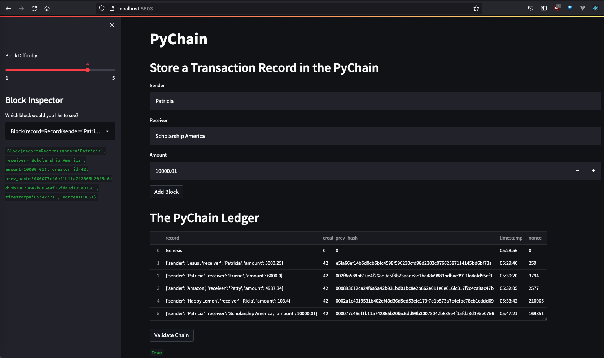
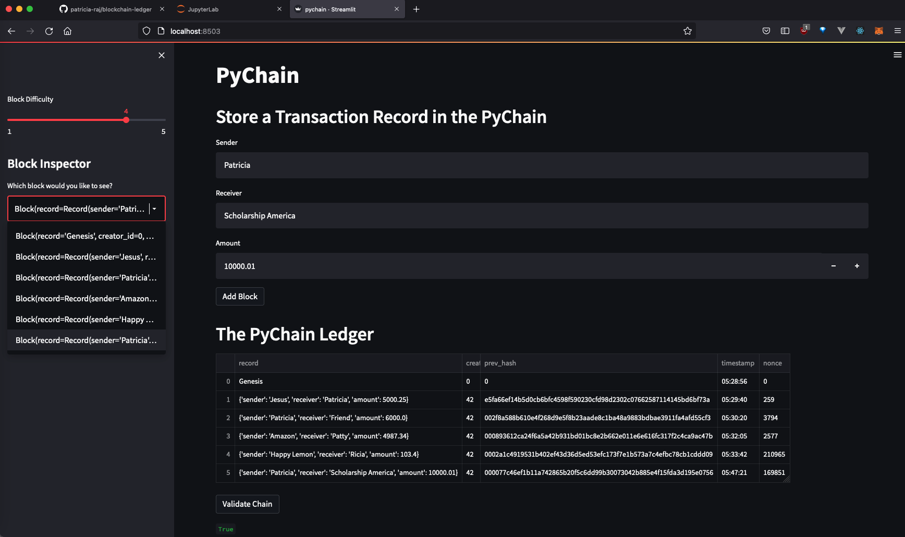

# Blockchain Ledger System

A blockchain-based ledger system is built and completed with a user-friendly web interface. 

* This ledger allows banks to conduct financial transactions containing money transfer money information between senders and receivers. 
* And helps to verify the integrity of the data in the ledger.

### Preview as below:

**1) Store Transaction Block to Ledger**

**2) Inspect the stored Block and validity**

**3) Demonstration of adding transaction block to ledger system and verifying the integrity of data.**
<!-- <video src=Resources/PyChain_Ledger_System_video.mov controls="controls" style="max-width: 730px;">
</video> -->

https://user-images.githubusercontent.com/99471693/178668238-3e8f0ee1-c60a-4c94-9d09-8a83dcd9a71f.mp4

